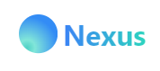

<h1 align="center">
  <a href="https://github.com/CommunityOfCoders/Inheritance-2023">
    
  </a>
  <br>
  Nexus
</h1>

<div align="center">
   <strong>Nexus</strong> - Interview Process made easier - <br>
  SIH hackathon 2024 || Team Nexus || Problem Statement 1653<br> <br>
</div>
<hr>

<details>
<summary>Table of Contents</summary>

- [Description](#description)
- [Links](#links)
- [Tech Stack](#tech-stack)
- [Progress](#progress)
- [Future Scope](#future-scope)
- [Applications](#applications)
- [Project Setup](#project-setup)
- [Usage](#usage)
- [Team Members](#team-members)
- [Screenshots](#screenshots)

</details>

## 📝Description

Meet Nexus, a web-based Selector-Applicant Simulation Software, which aims to revolutionize the interview process by providing an interactive, real-life boardroom experience for both interviewers and candidates. This platform will facilitate structured interviews, automating question generation and evaluation using advanced Natural Language Processing (NLP) and Machine Learning (ML) techniques. By ensuring relevancy and fairness, the solution will significantly enhance the quality of recruitment while reducing human biases.

1. Making interview process easier for experts and candidates
2. High Quality Video conferencing with whiteboard features simulating real life interviews
3. Automated Dynamically Generated Questions to make interview process balanced and helpful for experts as well as candidates

## 🔗Links

- [GitHub Repository](https://github.com/MSP20086/SIH-interview)
- [Demo Video](https://drive.google.com/file/d/1O4Sq1J_F9BLMDOxOYDvfweVuELTU3g46/view?usp=sharing)

## 🤖Tech-Stack

#### Full-Stack


#### Database


## 📈Progress

#### Implemented Features

- [x] Secure authentication system for experts and candidates to access the website
- [x] Friendly UI/UX design for users
- [x] Utilizing WebRTC and Agora SDK, the platform will enable live video interviews with features like whiteboard collaboration and screen sharing to mimic a boardroom setting.
- [x] Leveraging NLP and Large Language Models (LLMs), the platform will generate interview questions tailored to the candidate's area of expertise. This ensures that the questions are relevant and appropriate for the candidate's level.
- [x] A feedback loop mechanism will dynamically adjust the difficulty of questions based on the candidate's responses, ensuring a balanced and challenging interview.
- [x] Dashboard for the experts to keep a track on candidates's resume and for scoring each candidate's answer

## 🔮Future Scope

- [ ] The platform will evaluate candidate responses using NLP algorithms, providing a quantifiable score based on the relevancy and quality of the answers.
- [ ] To maintain objectivity, the platform will incorporate bias mitigation strategies, ensuring that the evaluation process is transparent and equitable.

## 💸Applications

1. By automating the question generation and evaluation process, the platform will reduce the time and effort required to conduct interviews, allowing RAC to process more candidates in less time.
2. The software will minimize human biases, promoting a more diverse and inclusive recruitment process. The dynamic adjustment of questions will ensure that all candidates are assessed fairly, based on their abilities.
3. By reducing the need for physical interviews and the associated logistics, the platform will lower the overall cost of recruitment.

## 🛠Project Setup

1. Clone the repository

```
git clone https://github.com/MSP20086/SIH-interview.git
```

2. Navigate to my-app, install required packages and run it.

```
npm install
npm run dev
```

## 💻Usage

#### Experts

1. Experts have to sign up for holding an interview.
2. Then user will redirected to dashboard, where they can track all scheduled interviews and past interviews and details about the candidate.
3. Experts can schedule new interviews and share the meet link to candidate via mail.
4. Experts can join the meet using the link in the dashboard
5. Experts can get suggested questions which are generated by ML model and score the response of candidate to evaluate the results

#### Candidates

1. Candidates have to sign up for joining interview.
2. Then either candidate can enter the interview-id which is sent to them prior to interview or directly click on link of interview portal.
3. In the interview portal, csandidate can fill about their relevant information and upload resume.
4. Then, candidate can join the meeting via link.
5. Candidates are given options to share screen, and whiteboard feature is also available.

## 👨‍💻Team Members

- [Varun](https://github.com/vxyzs)
- [Mihir](https://github.com/MSP20086)
- [Tanay](https://github.com/TanayGada)
- [Anish](https://github.com/AnishSingh09)
- [Jishnu](https://github.com/jjb825)
- [Kamakshi]
